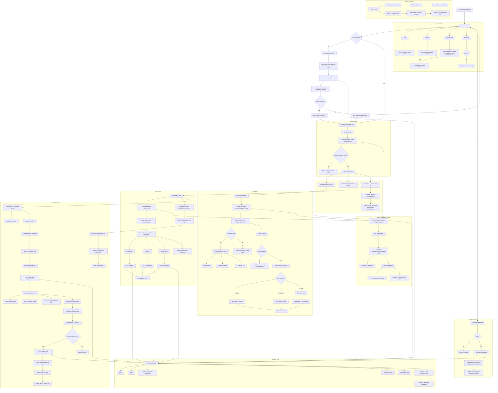
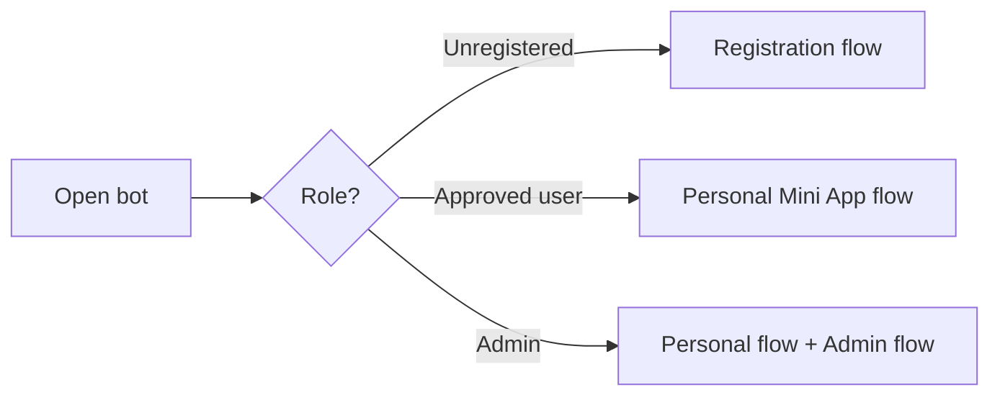
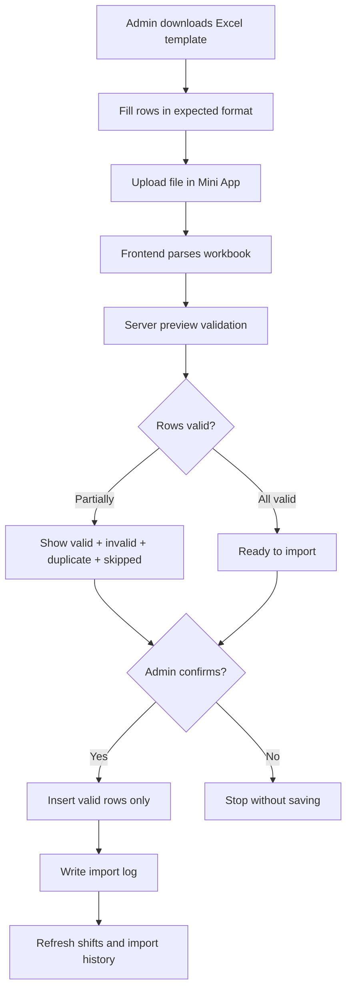
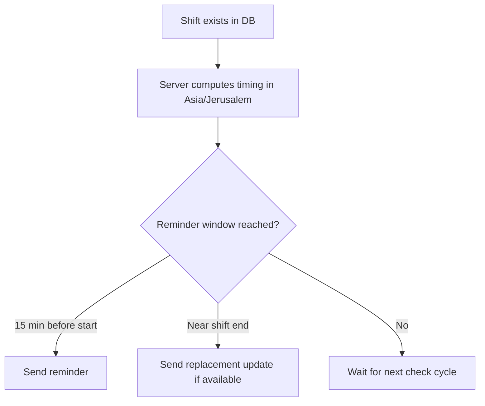
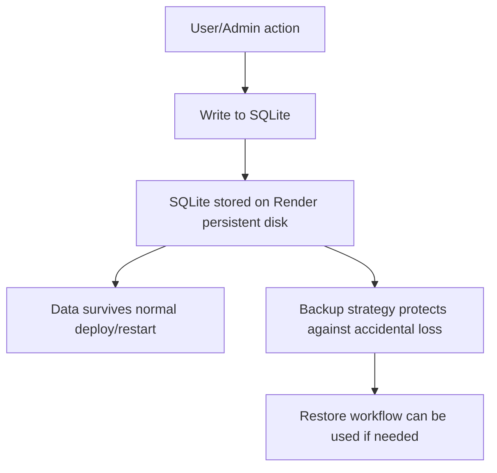

# 9950 Shifts Helper - Full Flowchart

Updated: 2026-04-23

## Full System Flow

```mermaid
flowchart TD
    A["User opens Telegram bot"] --> B["/start or menu"]
    B --> C{"User registered?"}

    C -- "No" --> D["Open registration flow"]
    D --> E["User sends: first name, last name, phone, rank, service type"]
    E --> F["Bot creates registration request"]
    F --> G["Admin receives new registration request"]
    G --> H{"Admin approves?"}
    H -- "Yes" --> I["User status -> approved"]
    H -- "No" --> J["User stays rejected/pending"]
    I --> K["User can open Mini App"]
    J --> B

    C -- "Yes" --> K["User can open Mini App"]

    subgraph MiniApp["Mini App Entry"]
        K --> L["Mini App loads"]
        L --> M["Frontend requests profile and server time"]
        M --> N{"Approved user or admin?"}
        N -- "No" --> O["Show waiting / blocked state"]
        N -- "Yes" --> P["Show main screen"]
    end

    subgraph MainScreen["Main Screen"]
        P --> Q["Show personal entry card"]
        P --> R["Show admin entry card if admin"]
        P --> S["Show 'who is on shift now' tile"]
        S --> T["Frontend requests /me/active-now"]
        T --> U["Server returns active shift people using Asia/Jerusalem"]
    end

    subgraph UserArea["User Area"]
        Q --> V["Enter personal area"]
        V --> W["Frontend requests /me/shifts and profile data"]
        W --> X["Server returns shifts + timing + server now"]
        X --> Y{"Any active shift?"}
        Y -- "Yes" --> Z["Show active shift block"]
        Z --> ZA["Elapsed time"]
        Z --> ZB["Progress percent"]
        Z --> ZC["Progress bar"]
        Y -- "No" --> ZD["Show next shift or empty state"]

        X --> ZE["Render shift list"]
        ZE --> ZF{"Shift completed?"}
        ZF -- "Yes" --> ZG["Render compact gray completed card"]
        ZF -- "No" --> ZH["Render regular shift card"]

        ZH --> ZI{"User responds?"}
        ZI -- "Magiya" --> ZJ["Save status = coming"]
        ZI -- "Lo batuach" --> ZK["Save status = maybe"]
        ZI -- "Lo מגיע" --> ZL["Request reason"]
        ZL --> ZM["Save status = no + reason"]

        ZJ --> ZN["Reload user shifts"]
        ZK --> ZN
        ZM --> ZN
    end

    subgraph TimeAndNotifications["Time / Notification Engine"]
        TO["Server timezone standard = Asia/Jerusalem"] --> TP["Shift timing helper"]
        TP --> TQ["Compute active/upcoming/completed state"]
        TQ --> TR["Used by API responses"]
        TQ --> TS["Used by reminders"]
        TS --> TT["15 min before shift reminder"]
        TS --> TU["Near shift end replacement update"]
    end

    subgraph HelpAndBotCommands["Bot Commands"]
        B --> BA["/help"]
        BA --> BB["Send structured Hebrew help text"]

        B --> BC["/thanks"]
        BC --> BD["Send ready-made thank-you flow"]

        B --> BE["/homescreen"]
        BE --> BF["Send explanation + video for adding Mini App to home screen"]

        B --> BG["/template"]
        BG --> BH{"Admin?"}
        BH -- "Yes" --> BI["Send Excel template download"]
        BH -- "No" --> BJ["Send admin-only warning"]
    end

    subgraph AdminArea["Admin Area"]
        R --> CA["Enter admin area"]
        CA --> CB["Frontend requests /admin/shifts"]
        CA --> CC["Frontend requests /admin/shift-import-runs"]
        CB --> CD["Server returns shifts calendar data"]
        CC --> CE["Server returns import run log"]

        CD --> CF["Show calendar / daily focus / shift cards"]
        CF --> CG["Create shift"]
        CF --> CH["Edit shift"]
        CF --> CI["Assign users"]
        CF --> CJ["See problems / gaps / responses"]

        CG --> CK["POST shift data"]
        CH --> CL["PATCH shift data"]
        CI --> CM["Save assignments"]
        CK --> CN["Reload admin shifts"]
        CL --> CN
        CM --> CN
    end

    subgraph ExcelImport["Excel Import Flow"]
        CA --> DA["Admin opens Excel import section"]
        DA --> DB["Download template"]
        DA --> DC["Choose Excel file"]
        DC --> DD["Frontend parses workbook"]
        DD --> DE["Skip helper/header rows"]
        DE --> DF["Build normalized rows"]
        DF --> DG["POST /admin/shift-import/preview"]
        DG --> DH["Server validates rows"]
        DH --> DI["Check required fields"]
        DH --> DJ["Check date/time format"]
        DH --> DK["Check duplicates in file and DB"]
        DH --> DL["Create preview summary"]
        DL --> DM["Return ready / invalid / duplicate / skipped rows"]
        DM --> DN["Show preview in admin UI"]
        DN --> DO{"Admin confirms import?"}
        DO -- "Yes" --> DP["POST /admin/shift-import/commit"]
        DO -- "No" --> DQ["Discard preview"]
        DP --> DR["Server inserts valid shifts only"]
        DR --> DS["Create import log entry"]
        DS --> DT["Reload shifts + import runs"]
        CE --> DU["Admin may clear import log"]
        DU --> DV["DELETE /admin/shift-import-runs"]
        DV --> DW["Delete only log rows"]
    end

    subgraph Broadcast["Broadcast Flow"]
        B --> EA["/broadcast message"]
        EA --> EB{"Admin?"}
        EB -- "No" --> EC["Reject command"]
        EB -- "Yes" --> ED["Load approved users"]
        ED --> EE["Send entered message to all approved users/admins"]
        EE --> EF["Return success/failure summary to admin"]
    end

    subgraph DataLayer["Storage Layer"]
        FA["SQLite database"] --> FB["users"]
        FA --> FC["shifts"]
        FA --> FD["shift_assignments / responses"]
        FA --> FE["shift_import_runs"]
        FA --> FF["admin/user state"]
        FA --> FG["stored on Render persistent disk"]
        FG --> FH["backups preserved separately"]
    end

    subgraph DeployAndRuntime["Deploy / Runtime"]
        GA["GitHub push"] --> GB["Render backend deploy"]
        GA --> GC["Vercel frontend deploy"]
        GB --> GD["Backend starts"]
        GD --> GE["Health check /healthz"]
        GC --> GF["Mini App serves latest frontend"]
        GF --> GG["Telegram opens Mini App URL"]
    end

    M --> TO
    W --> TO
    CB --> TO
    DG --> FA
    DP --> FA
    CK --> FA
    CL --> FA
    CM --> FA
    ED --> FA
    F --> FA
    I --> FA
```

## Role-Based Flow

```mermaid
flowchart LR
    A["Open bot"] --> B{"Role?"}
    B -- "Unregistered" --> C["Registration flow"]
    B -- "Approved user" --> D["Personal Mini App flow"]
    B -- "Admin" --> E["Personal flow + Admin flow"]
```

## Excel Import Flow

```mermaid
flowchart TD
    A["Admin downloads Excel template"] --> B["Fill rows in expected format"]
    B --> C["Upload file in Mini App"]
    C --> D["Frontend parses workbook"]
    D --> E["Server preview validation"]
    E --> F{"Rows valid?"}
    F -- "Partially" --> G["Show valid + invalid + duplicate + skipped"]
    F -- "All valid" --> H["Ready to import"]
    G --> I{"Admin confirms?"}
    H --> I
    I -- "Yes" --> J["Insert valid rows only"]
    I -- "No" --> K["Stop without saving"]
    J --> L["Write import log"]
    L --> M["Refresh shifts and import history"]
```

## Notification Flow

```mermaid
flowchart TD
    A["Shift exists in DB"] --> B["Server computes timing in Asia/Jerusalem"]
    B --> C{"Reminder window reached?"}
    C -- "15 min before start" --> D["Send reminder"]
    C -- "Near shift end" --> E["Send replacement update if available"]
    C -- "No" --> F["Wait for next check cycle"]
```

## Data Safety Flow

```mermaid
flowchart TD
    A["User/Admin action"] --> B["Write to SQLite"]
    B --> C["SQLite stored on Render persistent disk"]
    C --> D["Data survives normal deploy/restart"]
    C --> E["Backup strategy protects against accidental loss"]
    E --> F["Restore workflow can be used if needed"]
```

